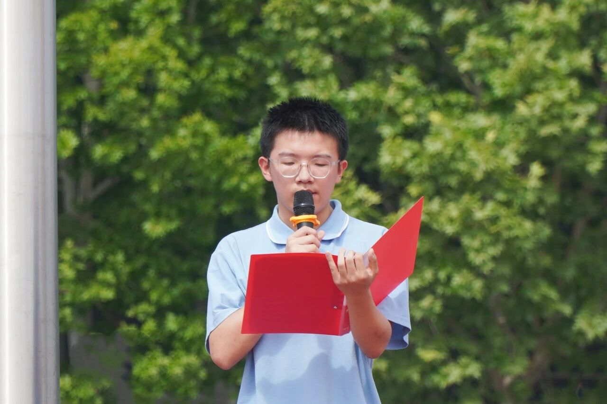
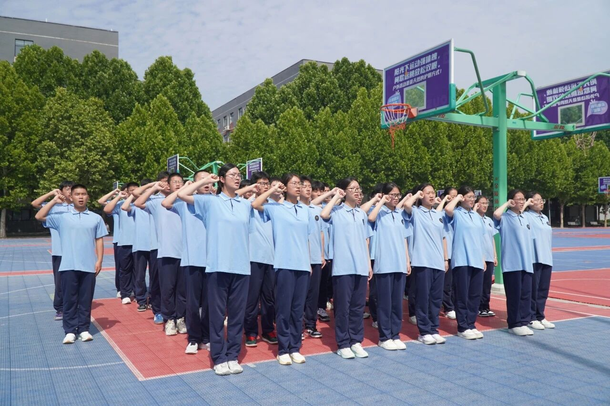
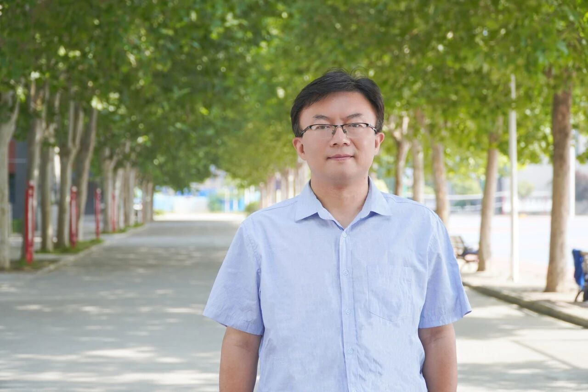
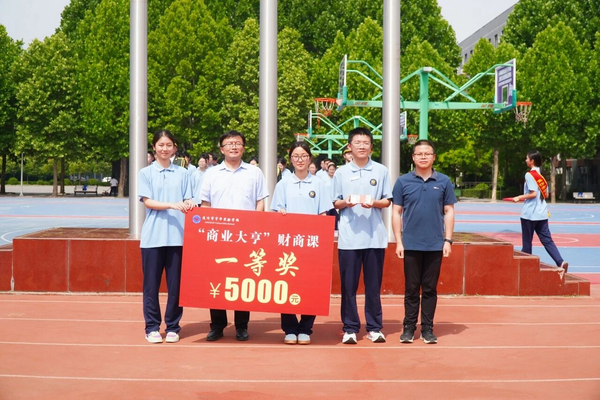
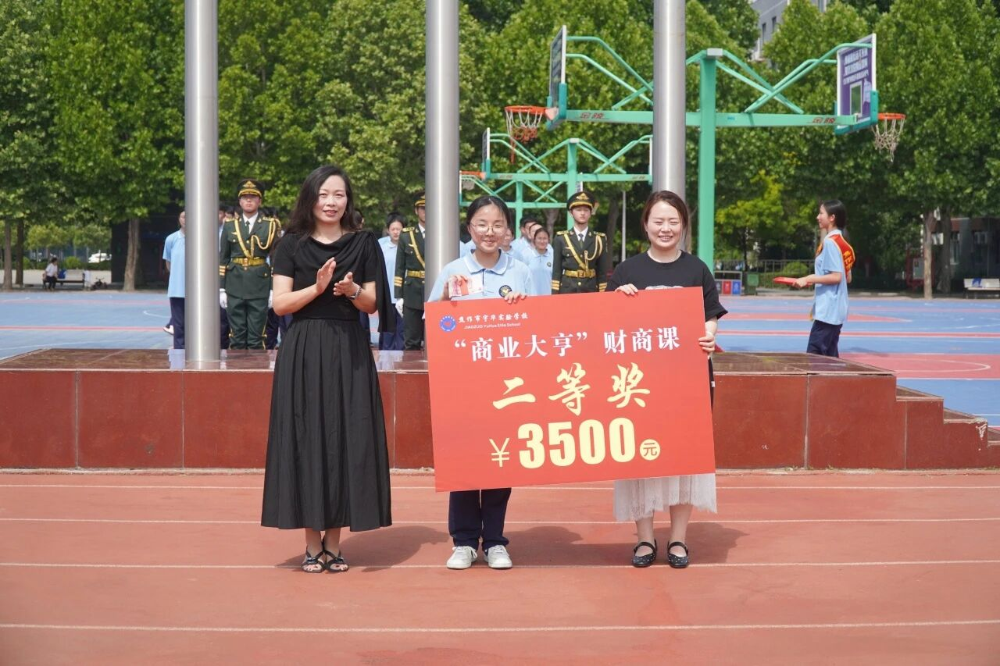
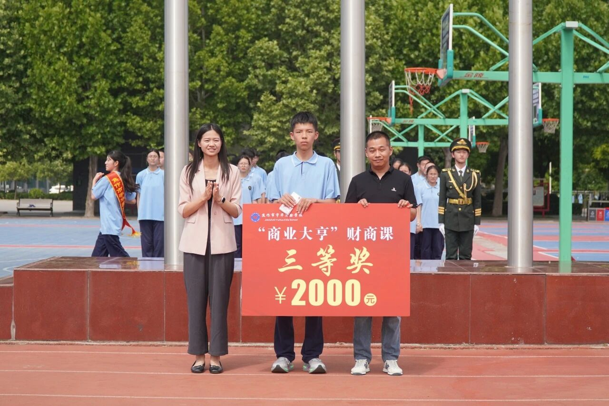

## ** 国旗下演讲高二2班风采展示 ** 
##                                                     国旗下演讲
---

[grid]

[/grid]

尊敬的老师、亲爱的同学们：大家好！我是高二2班 张力，今天我演讲的题目是“科技落校园 历练出少年”。就在刚刚过去的5月14日，相信大家的记忆还停留在那个充满烟火气、更充满科技感的中心广场。我们共同经历了一场名为“创想未来”的校园创业模拟实践活动。今天，我很荣幸能站在这里，与大家分享这场微缩社会体背后的成长与感悟。回顾那一天，我们经历了一场从无到有的奇妙旅程。从最初在项目研讨会上的激烈争论，到带着精心打磨的策划书去德育处“工商局”申请那一张薄薄的营业执照；从一纸蓝图，到大家亲手用汗水搭建起一条多元错落的青春创业街区。在这场真实的财商课中，我们不再是象牙塔里单纯的消费者，而是真正成为了规则的遵守者、资源的整合者和价值的创造者。在这次活动中，我和我的团队——高二宏志段的同学们，承担了一个特殊的使命：为这场沙盒经济构建数字化的底层金融逻辑。我们运用平时积累的编程知识，将传统的校园卡升级为了集支付与结算于一体的数字钱包，并引入了“官方银行”的信用借贷与“原始股”的模拟投资系统。当看到一行行冷冰冰的代码最终化作大家手中流畅的交易体验，化作大屏上跳动的红绿数字时，我们深刻地体会到：真正的科技创新，不是为了炫技，而是为了赋能商业、服务现实。然而，一套完美的系统要真正落地，仅仅依靠屏幕前的代码是远远不够的。在跳动的数据背后，是我们用双脚丈量出的信任。活动前夕，为了推广这套全新的数字结算模式，我们一家家摊位去谈合作，耐心讲解系统优势；我们走遍每一个班级，和同学们面对面沟通充卡事宜，打消大家的顾虑。而在活动结束后，当广场的喧嚣散去，我们的工作并未停止。我们再次挨个班级上门，为大家妥善办理退卡，并严谨地对接各位班主任，一笔一笔地完成信用贷款的核销与偿还。这一步步的脚印，不仅是体力的付出，更是对“契约精神”与“责任担当”的坚守。它让我们团队切身懂得，商业的基石不仅仅是前沿的技术，更是人与人之间真实的连接、沟通与信任。当然，这场财商实战的精彩，属于在场的每一个人。我们看到了高一年级“欢欢喜洗·飞驰人生”洗车店里同学们挥洒汗水的背影，那是服务业最朴实的敬业精神；我们闻到了“虾闹集市”里排起长龙的麻辣鲜香，看到了甜蜜巧克力喷泉旁的欢声笑语，那是对市场需求的精准捕捉；我们还体验了汉服馆里的非遗传承，以及赛道卡丁车和VR虚拟现实的感官碰撞。无论是应对客流高峰时的手忙脚乱，还是根据供需关系灵活调整定价，亦或是处理售后纠纷时的耐心沟通。每一个摊位，都是一间微缩的企业；每一次交易，都是对社会运行法则的致敬。我们在应对物资调配、成本核算等真实挑战中，锤炼了解决问题的能力，也加深了团队协作的羁绊。同学们，创业的土壤虽在模拟中发芽，但创新的精神将伴随我们终生。这场行走中的成长课程告诉我们，财商素养绝不仅仅是精打细算，它更是前瞻的视野、契约的精神和敢于试错的勇气。让我们带着这份在实战中淬炼出的远见与协作精神，投入到今后的学习与生活中去。在未来的生涯规划中，敢于做梦，更善于造梦，用青春的智慧，去丈量更广阔的天地！我的演讲到此结束，谢谢大家！
##                                                   班级风采展示
[grid]

[/grid]

迎着朝阳，昂首奋进的是高二2班全体学子。以宏志立心，以笃行逐梦，教室里勤学善思，操场上意气风发。他们心怀理想，信念坚定，不惧前路风雨；团结友善，拼搏向上，尽显少年热血风华。课堂深耕学识，课余砥砺品格，以青春之名担时代使命，凭满腔热忱赴逐梦征程。全体同学凝心聚力，笃行不怠，用努力书写成长，用奋进奔赴远方，尽显宏志少年昂扬向上的最美姿态。
##                                                    班主任寄语
[grid]

[/grid]
                                                      **杨乃江**
同学们，迎着朝阳，我们又一次齐聚国旗下。步入高二，这是高中旅程承上启下的关键一程，是沉淀自我、蓄力成长的黄金时期。少年自有凌云志，不负韶华行且知。站在崭新起点，希望大家收起浮躁之心，树立清晰目标，踏实走好每一天。课堂专注思考，课余勤勉奋进，以自律约束言行，以坚韧直面困难。国旗飘扬，见证我们的成长；青春正好，莫负大好时光。愿全体同学心怀家国，恪守校规，互帮互助，砥砺品格。把努力藏在日常，把理想刻在心底，脚踏实地勤学苦练，不断突破自我。以昂扬向上的姿态奔赴前路，用汗水书写属于高二学子的精彩篇章。

为深耕素质教育、厚植财商底蕴、培育创新思辨与协作精神，我校举办“商业大亨财商课”。秉承“培养不同层次出类拔萃的人”的理念，同学们化身老板，在市集中大胆创想、躬行实践，将奇思妙想变为创业实景，在经营中凝心聚力、突破自我，尽显宇华学子青春风骨。今日，全校师生齐聚，共同见证少年荣耀，定格高光时刻！
##                                                     一等奖
[grid]

[/grid]
##                                                     二等奖
[grid]

[/grid]
##                                                     三等奖
[grid]

[/grid]
烟火市集藏真知，躬身实践促成长。这场财商盛宴让同学们体悟商业逻辑，涵养理性理财、勇于担当与携手共进的精神。愿全体学子以此为契，将实践化为动力，心怀热爱，笃行不怠，在青春征途上奔赴更璀璨的远方。
编辑：闫雯静
拍摄：闫雯静
校审：蒋志富